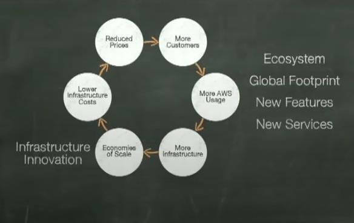

# AWS-03 Advantages of the Cloud
Looking closely at the 6 benefits of the cloud and describing it in your own words.
#
## Key terminology
#
## Exercise
#
### Sources
6 Advantages of Cloud Computing
https://www.youtube.com/watch?v=b4OGEu449l0

AWS LIVE The Six Main Benefits of Cloud Computing with Amazon Web Services
https://www.youtube.com/watch?v=yMJ75k9X5_8

https://docs.aws.amazon.com/whitepapers/latest/aws-overview/six-advantages-of-cloud-computing.html
#
### Overcome challenges
#
## Results
### The six advantages of cloud computing
- ### Trade Capital expense (CapEx) for variable expense (OpEx)
   Pay only when you use computing resources, and pay only for how much you use. No more big investments in data centers and servers before you know how you will use them.

   To recall the example from the previous assignment, you only pay where necessary for the use of the paper and ink, the printer itself is already purchased.
#
- ### Benefit from massive economies of scale
  As the usage of hundreds of thousands of customers is aggregated in the cloud, providers such as AWS can achieve higher economies of scale, ensuring lower pay as you go prices. 

  This creates a nice circle.
  More (larger) customers creates more AWS usage, which requires more infrastructure, which in turn creates economies of scale. This lowers the cost of infrastructure and thus lowered prices, which in turn ensures more customers, etc. 

  During this course of the circle, there is also plenty of room and opportunity for the development of new functions and services in each component. Which in turn brings many benefits and what again strengthened the circle.

  
#
- ### Stop guessing capacity
  You no longer have to guess at the capacity needs of your infrastructure. When you make a capacity decision before implementing an application, you often end up with expensive unused resources or limited capacity. With cloud computing, these problems fall away. You have access to as much or as little capacity as you need, and can scale up and down as needed with just minutes notice.
#
- ### Increase speed and agility
  In a cloud computing environment, new IT resources are only a click away, which means that you reduce the time to make those resources available to your developers from weeks to just minutes. This results in a dramatic increase in agility for the organization, since the cost and time it takes to experiment and develop is significantly lower.
  #
- ### Stop spending money on running and maintaining data centers
  Focus on projects that differentiate your business, not the infrastructure. Cloud computing lets you focus on your own customers, rather than on the heavy lifting of racking, stacking, and powering servers.
#
- ### Go global in minutes
  Easily deploy your application in multiple regions around the world with just a few clicks. This means you can provide lower latency and a better experience for your customers at minimal cost.