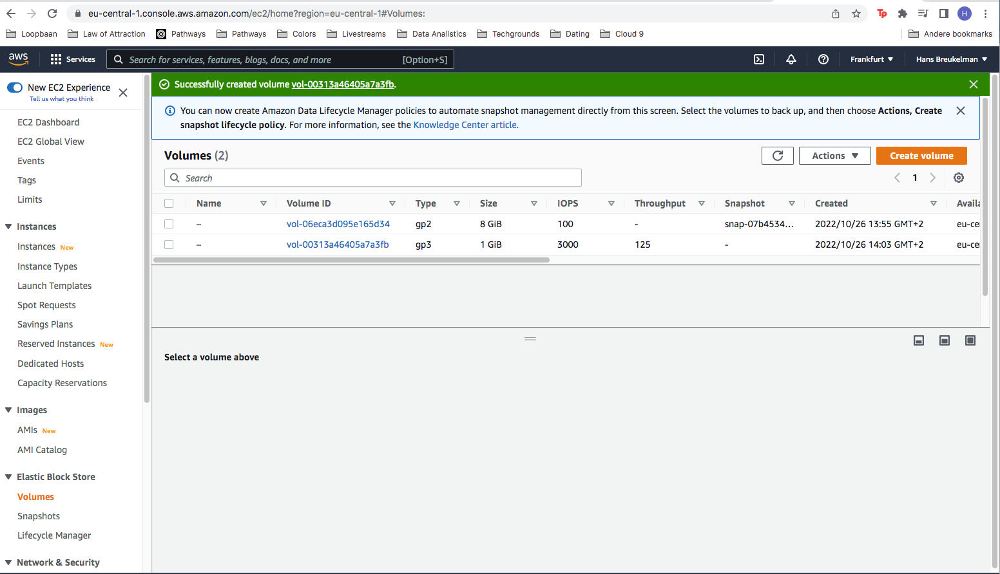
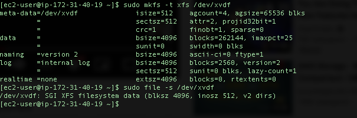
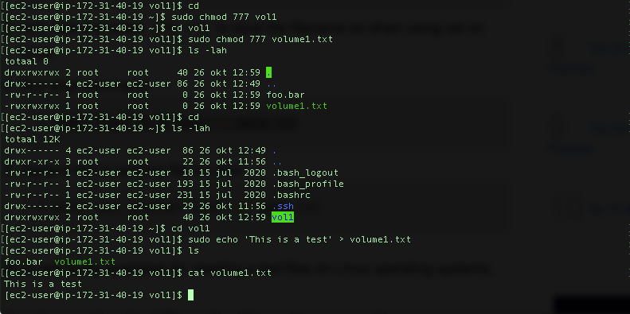
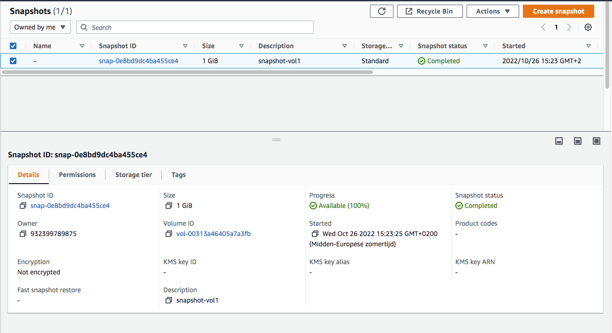
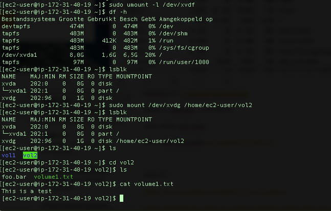

# AWS-07 EBS
[Give a short summary of the subject matter.]

## Key terminology
[Write a list of key terminology with a short description. To prevent duplication you can reference to previous excercises.]

## Exercise
### Sources
[List the sources you used for solving the exercise]

### Overcome challenges
[Give a short description of the challeges you encountered, and how you solved them.]

### Results
Created an instance and a new volume.

Attached the volume to the instance.

Made a text file

Made a snapshot of the volume and created a new volume out of it.

Unmounted the original volume en mounted the new one created from the snapshot. With the text file.

