# AWS-10 Virtual Private Cloud (VPC)
Everything about the Virtual Private Cloud, A virtual private cloud (VPC) is a private cloud computing environment within a public cloud. Essentially, a VPC provides logically isolated sections of a public cloud to provide a virtual private environment.

## Key terminology
### Virtual Private Cloud
Amazon VPC is typically described as a virtual private data center in the cloud. It is a virtual network that is logically isolated from other VPCs.
With a VPC you have full control over the design of the network. You can create subnets, internet gateways (igw), NAT gateways, VPN connections, and more.

### EC2
Amazon Elastic Compute Cloud is part of Amazon.com's cloud-computing platform, Amazon Web Services, which allows users to rent virtual computers on which to run their own computing applications.

### RDS
Amazon Relational Database Service is a distributed relational database service from Amazon Web Services. It is a web service that runs "in the cloud" and is designed to simplify the installation, operation and scaling of a relational database for use in applications.

### ECS
Amazon Elastic Compute Cloud is een onderdeel van Amazon.com's cloud-computingplatform, Amazon Web Services, waarmee gebruikers virtuele computers kunnen huren waarop ze hun eigen computerapplicaties kunnen draaien.

### CIDR block
CIDR (Classless Inter-Domain Routing) -- also known as supernetting -- is a method of assigning Internet Protocol (IP) addresses that improves the efficiency of address distribution and replaces the previous system based on Class A, Class B and Class C networks.

## Exercises
Making an infrastructure in the AWS environment divided into four exercises. The infrastructure should be built as the image below shows.

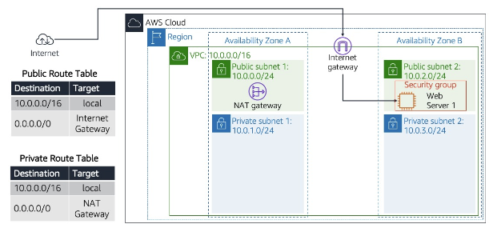

### Sources
https://docs.aws.amazon.com/AWSEC2/latest/UserGuide/elastic-ip-addresses-eip.html

https://www.youtube.com/watch?v=UAdlVht4Xlw

Exercises 1 + 2

https://www.youtube.com/watch?v=UAdlVht4Xlw

https://www.youtube.com/watch?v=AKQ7FdEuWz4

https://docs.aws.amazon.com/directoryservice/latest/admin-guide/gsg_create_vpc.html

Exercise 3

https://www.youtube.com/watch?v=nA3yN76cNxo

Exercise 4

https://intellipaat.com/community/41704/how-can-i-assign-a-public-dns-to-an-ec2-instance\

### Overcome challenges
[Give a short description of the challeges you encountered, and how you solved them.]

## Results
### **Exercise 1**
- Allocate an Elastic IP address to your account.

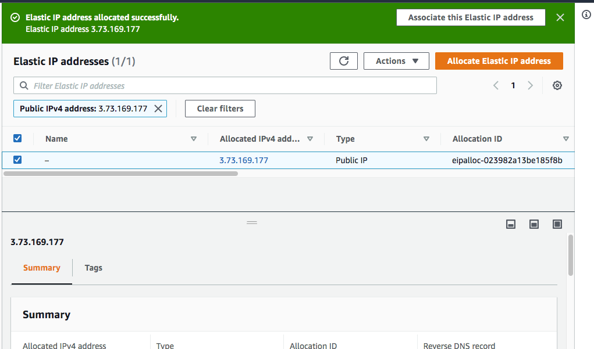

Creating a new VPC with the following requirements:
- Region: Frankfurt (eu-central-1)
VPC with a public and a private subnet
- Name: Lab VPC
- CIDR: 10.0.0.0/16
- Requirements for the public subnet:
  - Name: Public subnet 1
  - CIDR: 10.0.0.0/24
  - AZ: eu-central-1a
- Requirements for the private subnet:
  - Name: Private subnet 1
  - CIDR: 10.0.1.0/24
  - AZ: eu-central-1a

VPC created

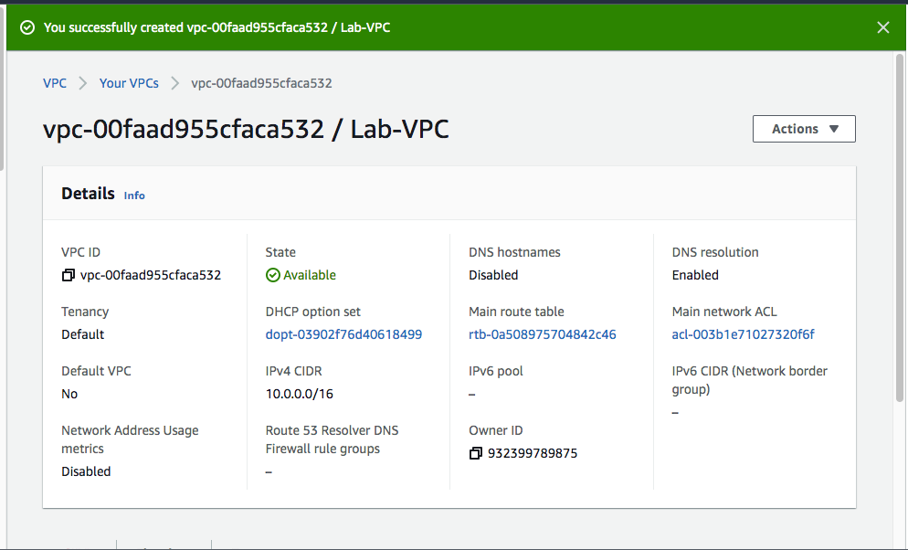

Created the two subnets

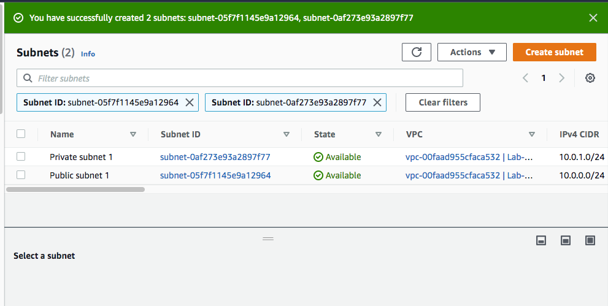

Changed the settings of the public subnet:
- Enable auto-assign public IPv4 addres

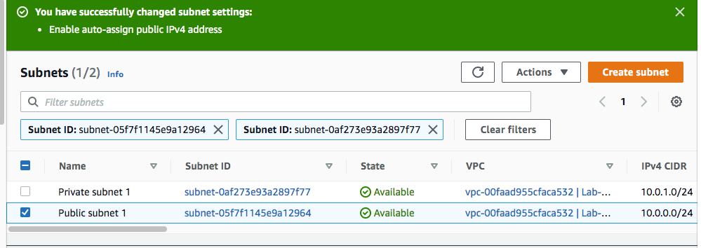

Created an IGW (Internet Gateway)

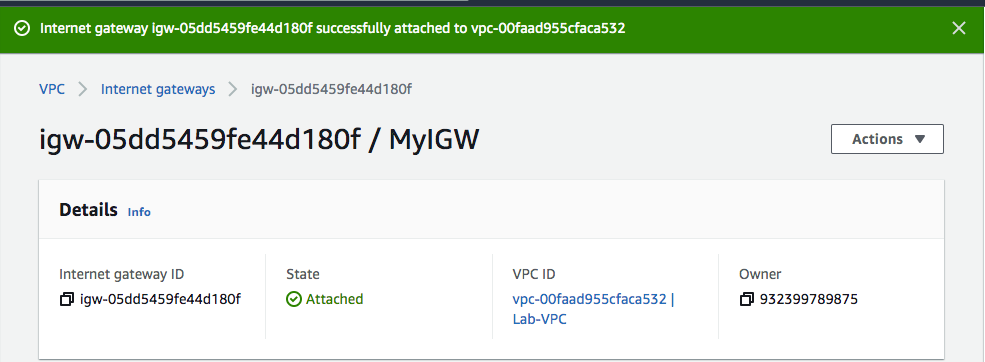

Created an private route table

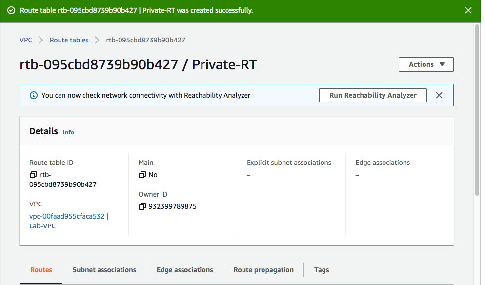

I assigned the private subnet to this private route table

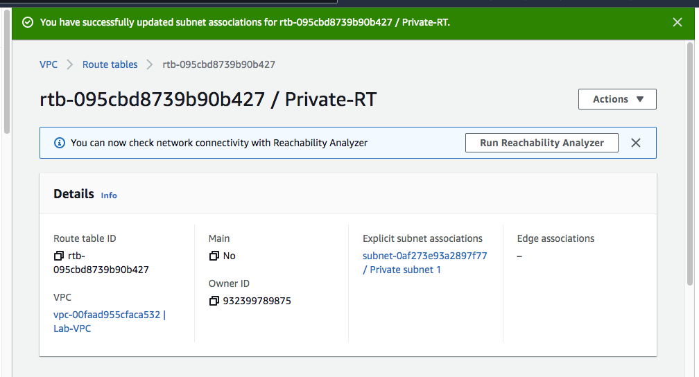

Created an NAT gateway

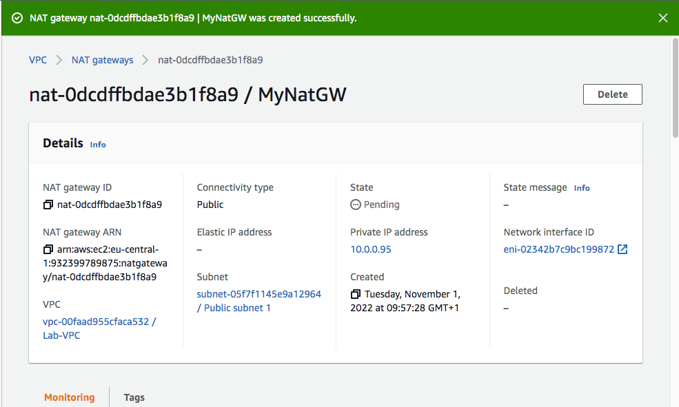
#
### **Exercise 2**
Create two additional subnets:
- public subnet 2:
  - VPC: Lab VPC
  - Name: Public Subnet 2
  - AZ: eu-central-1b
  - CIDR: 10.0.2.0/24
- private subnet 2:
  - VPC: Lab VPC
  - Name: Private Subnet 2
  - AZ: eu-central-1b
  - CIDR: 10.0.3.0/24

I now have four availible subnets

For the public subnet I changed the settings
- Enable auto-assign public IPv4 addres

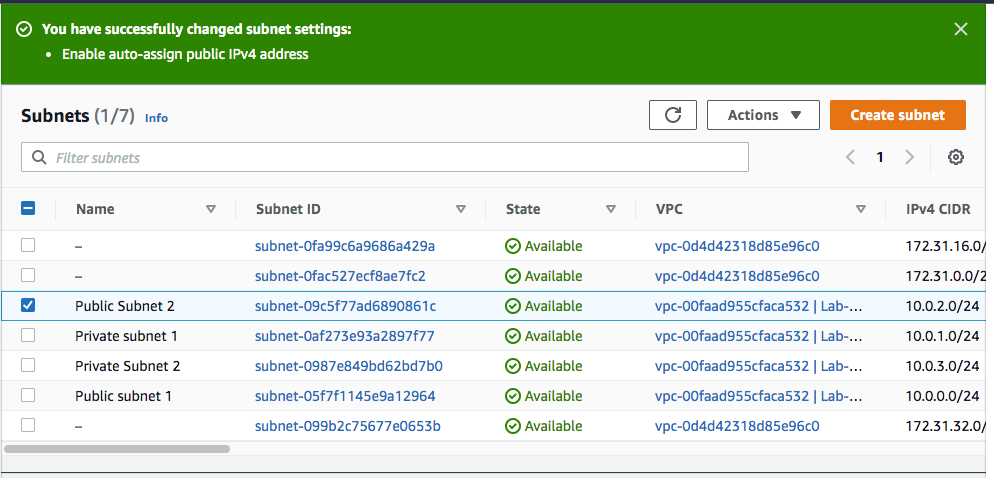

I assign the private subnets to the previously created private route table and I assign the public subnets to the public route table.

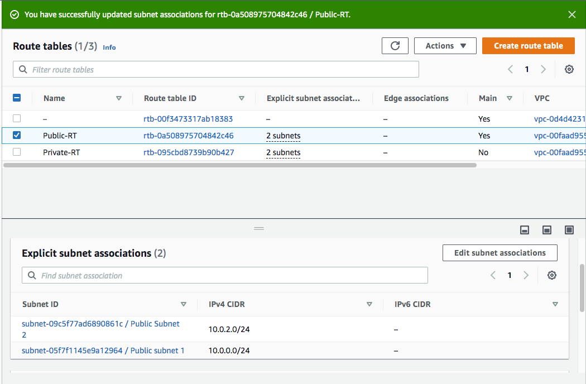
#
### **Exercise 3**
Created an Security Group with the following requirements:
- Name: Web SG
- Description: Enable HTTP Access
- VPC: Lab VPC
- Inbound rule: allow HTTP access from anywhere
- Outbound rule: Allow all traffic

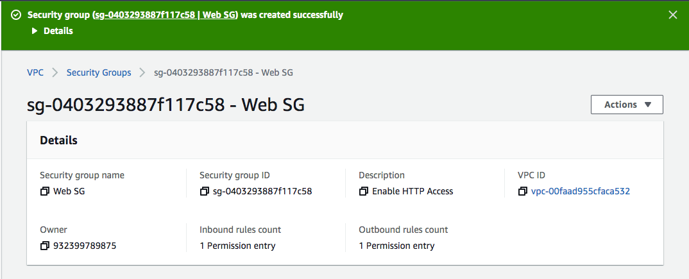
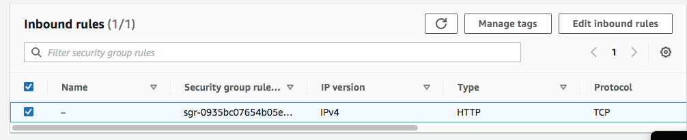
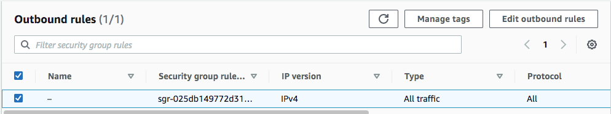
#
### **Exercise 4**
Launched an EC2 instance with the following requirements:
- AMI: Amazon Linux 2
- Type: t3.micro
- Subnet: Public subnet 2
- Auto-assign Public IP: Enable
- User data:
```
#!/bin/bash
# Install Apache Web Server and PHP
yum install -y httpd mysql php
# Download Lab files
wget https://aws-tc-largeobjects.s3.amazonaws.com/CUR-TF-100-RESTRT-1/80-lab-vpc-web-server/lab-app.zip
unzip lab-app.zip -d /var/www/html/
# Turn on web server
chkconfig httpd on
service httpd start
```
- Tag:
- Key: Name
- Value: Web server
- Security Group: Web SG
- Key pair: no key pair

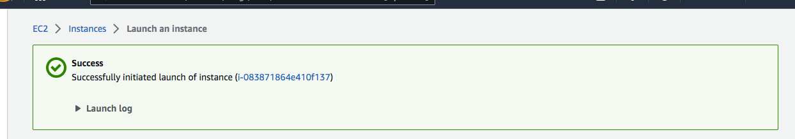
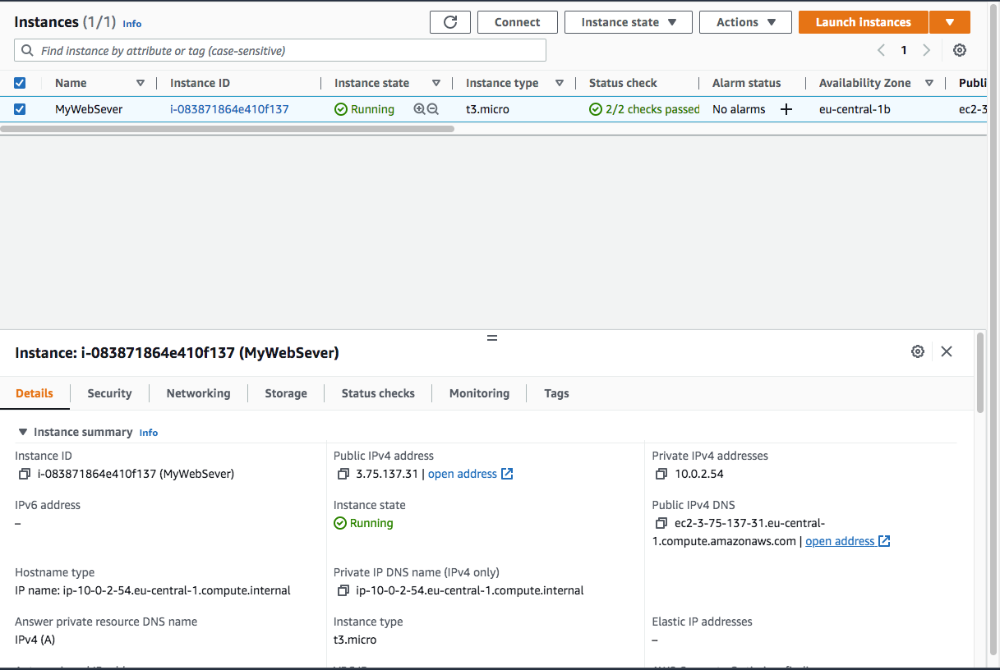

Connected to my server using the public IPv4 DNS name

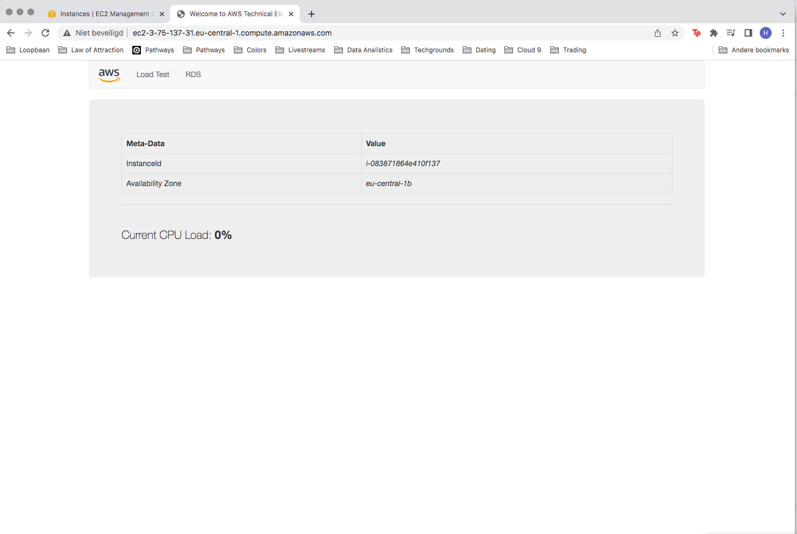


  
