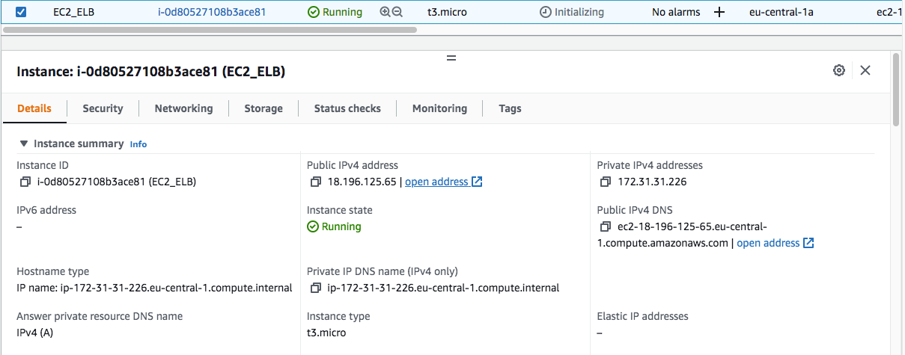
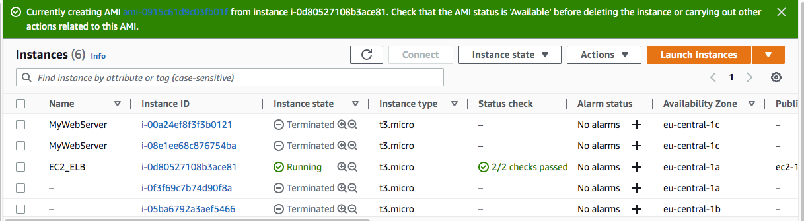
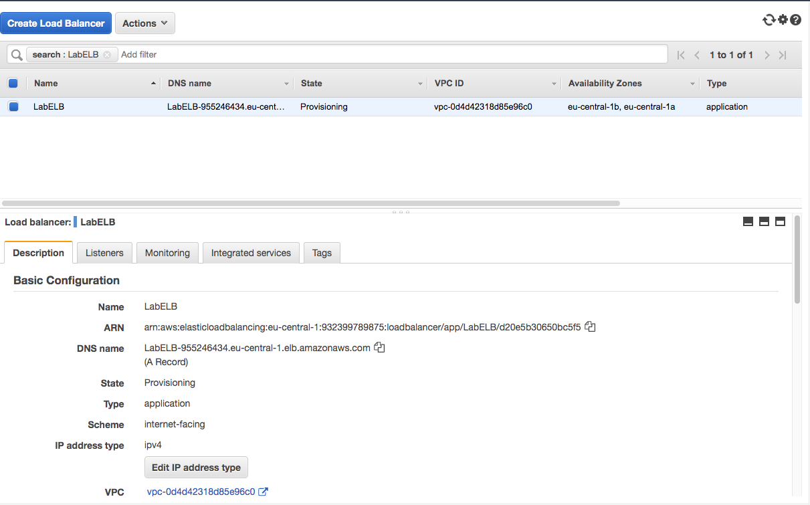
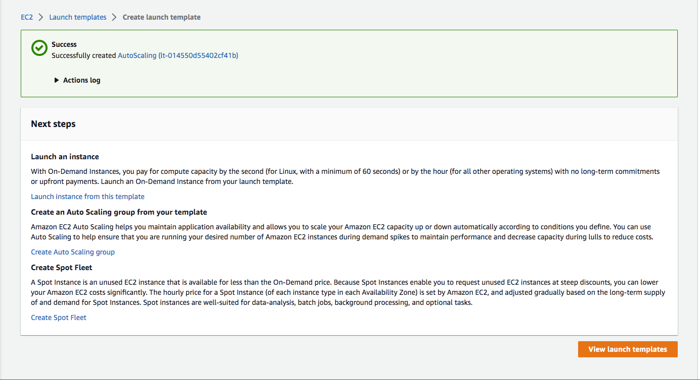
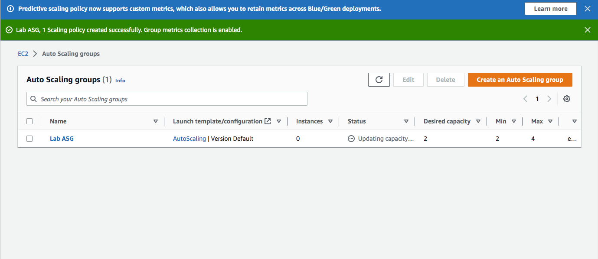
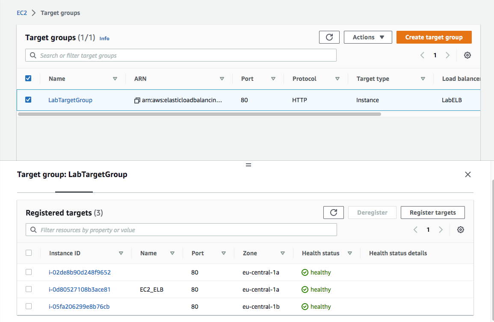
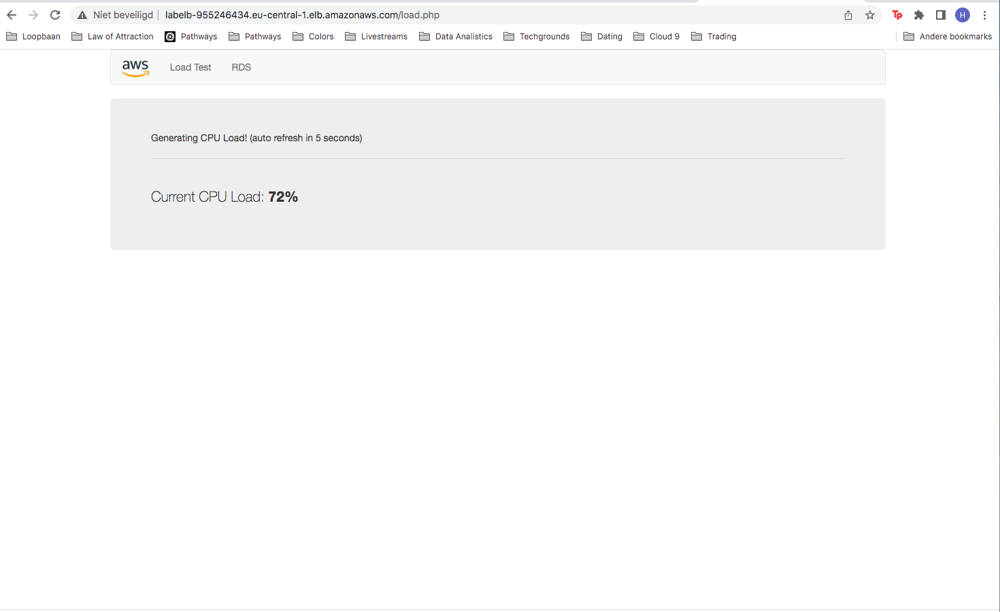

# AWS-11 Elastic Load Balancing (ELB) & Auto Scaling
Everything about the service that allows automatic scaling in server usage.

## Key terminology
### Elastic Load Balancing (ELB)
Elastic Load Balancing (ELB) automatically distributes incoming application traffic across multiple targets and virtual appliances in one or more Availability Zones (AZs).

### Auto Scaling
AWS Auto Scaling monitors your applications and automatically adjusts capacity to maintain steady, predictable performance at the lowest possible cost.

### Auto Scaling Group
An Auto Scaling group contains a collection of EC2 instances that are treated as a logical grouping for the purposes of automatic scaling and management. An Auto Scaling group also lets you use Amazon EC2 Auto Scaling features such as health check replacements and scaling policies.

### AMI
An Amazon Machine Image (AMI) is a supported and maintained image provided by AWS that provides the information required to launch an instance. You must specify an AMI when you launch an instance.

### CloudWatch
Amazon CloudWatch collects and visualizes real-time logs, metrics, and event data in automated dashboards to streamline your infrastructure and application maintenance.
#

## Exercise
Creating an infrastructure with an ELB and Auto scaling. Devided over four exercises.

### Sources
https://www.youtube.com/watch?v=qpHLRc4Qt1E

https://www.youtube.com/watch?v=NNrDr8cnUzs

https://docs.aws.amazon.com/autoscaling/ec2/userguide/auto-scaling-groups.html
#

### Overcome challenges
[Give a short description of the challeges you encountered, and how you solved them.]

## Results
### **Exercise 1**
Launch an EC2 instance with the following requirements:
- Region: Frankfurt (eu-central-1)
- AMI: Amazon Linux 2
- Type: t3.micro
- Security Group: Allow HTTP
- User data:
```
#!/bin/bash
# Install Apache Web Server and PHP
yum install -y httpd mysql php
# Download Lab files
wget https://aws-tc-largeobjects.s3.amazonaws.com/CUR-TF-100-RESTRT-1/80-lab-vpc-web-server/lab-app.zip
unzip lab-app.zip -d /var/www/html/
# Turn on web server
chkconfig httpd on
service httpd start
```


Created an AMI from my instance


### **Exercise 2**
Created an application load balancer with the following requirements:
- Name: LabELB
- Listener: HTTP on port 80
- AZs: eu-central-1a and eu-central-1b
- Subnets: must be public
- Security Group: 
  - Name: ELB SG
  - Rules: allow HTTP access
- Target Group:
  - Name: LabTargetGroup
  - Targets: to be registered by Auto Scaling


#
### **Exercise 3**

Created a launch template for the Auto Scaling group. It has to be identical to the server that is currently running.



From that launch template I created an Auto Scaling group with the following requirements:
- Name: Lab ASG
- Launch Configuration: Web server launch configuration
- Subnets: must be in eu-central-1a and eu-central-1b
- Load Balancer: LabELB
- Group metrics collection in CloudWatch must be enabled
- Group Size:
  - Desired Capacity: 2
  - Minimum Capacity: 2
  - Maximum Capacity: 4
- Scaling policy: Target tracking with a target of 60% average CPU utilisation




#

### **Exercise 4**
Verifying that the EC2 instances are online and that they are part of the target group for the load balancer and are healthy.



Accessed the server via the ELB by using the DNS name of the ELB and performed an load test on my server(s) using the website on my server to activate auto scaling.


