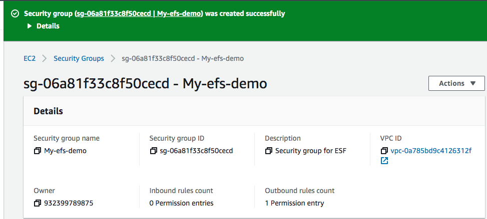
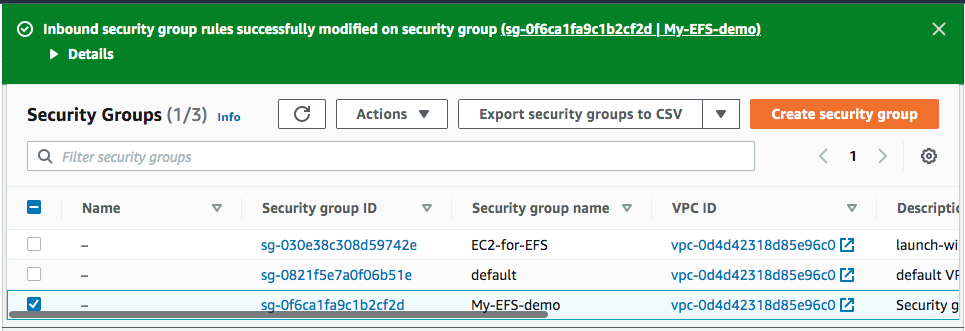
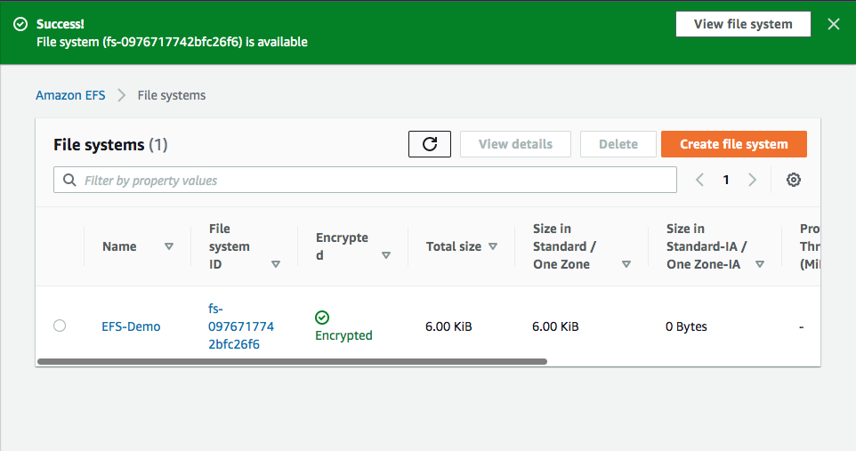
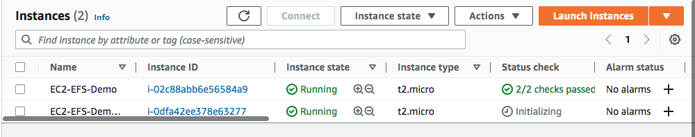
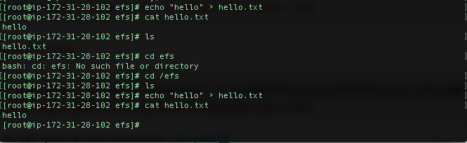
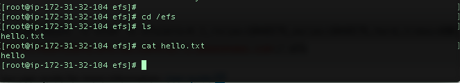

# Files, AppServices, CDN, DNS, Database

## Exercise
Studying and documenting and practices
#
### Sources
Elastic Beanstalk

https://www.youtube.com/watch?v=6MXExbH3mts

https://www.youtube.com/watch?v=uiM1xzOX8Qg

https://www.youtube.com/watch?v=yjHmzo91Rek

https://aws.amazon.com/elasticbeanstalk/
#
CloudFront

https://www.youtube.com/watch?v=AT-nHW3_SVI

https://www.youtube.com/watch?v=WZjFBxEgjvg

#
Route 53

https://www.youtube.com/watch?v=yRIY7BJohfo

https://www.youtube.com/watch?v=BtiS0QyiTK8
#
EFS

https://www.youtube.com/watch?v=vAV4ASDnbN0

https://www.youtube.com/watch?v=Aux37Nwe5nc

https://www.youtube.com/watch?v=4jy2FILK5R8
#
RDS/Aurora

https://www.youtube.com/watch?v=FzxqIdIZ9wc
#

### Overcome challenges
[Give a short description of the challeges you encountered, and how you solved them.]

## Results
### **Using EFS**
To learn about the Elastic File System and how to apply it, I created an infrastructure that looks something like the image below.

First I created an Security Group

Then I created an file system, with three different availability zones.

Created two EC2 instances with both different AZ's

Then I mounted and attached the instances to the file system.
To show that the instances are linked to the file system, I created a text file in one of the instances.

The file system ensured that the text file was also availible in the other EC2 instance

#
### **Using RDS, Aurora**

